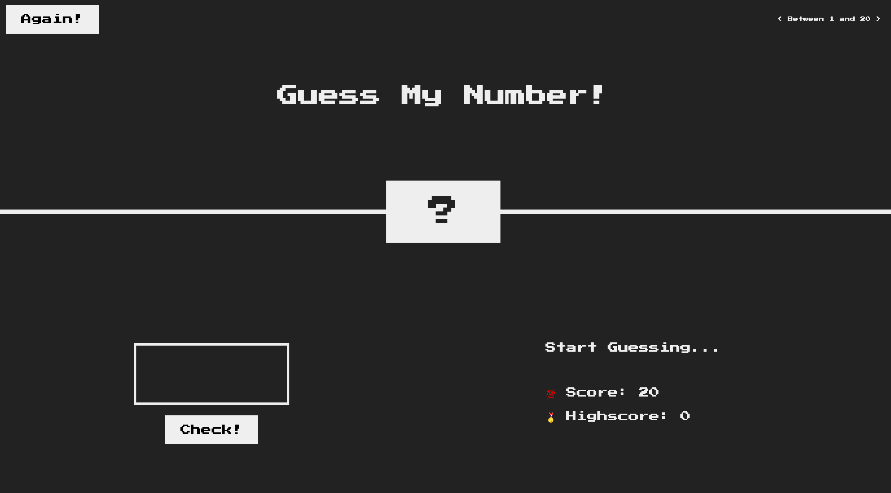

# Guess-My-Number

## Discription

Pretty straightforward mini game, where you have to guess a number between 1 to 20 and you have 20 tries for that.
Built with vanilla javascript, HTML and CSS.

## Author

- GitHub Repo: (Giorgi Gurgenidze)[https://github.com/gurgenidzegiorgi/Guess-My-Number]
- Live URL: (GitHub)[https://gurgenidzegiorgi.github.io/Guess-My-Number/]
